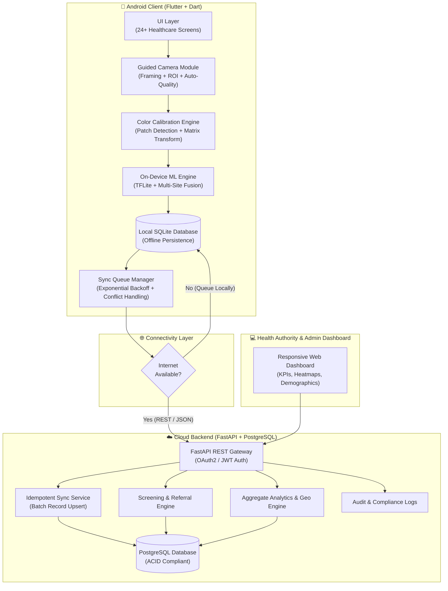
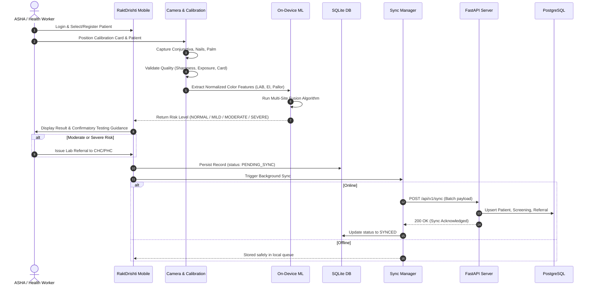

# RaktDrishti System Architecture

> **Omnikon National Hackathon 2026** — *Omni_BioTech_2: Non-Invasive Anemia Screening*
> **Tagline**: "See the risk. Confirm with confidence."

---

## 1. Executive Summary

**RaktDrishti** is an Android-first, offline-resilient healthcare screening platform designed for frontline health workers (ASHA, ANM, Anganwadi workers) and parents in resource-constrained rural and semi-urban settings. It provides non-invasive anemia risk screening using smartphone camera images of three key anatomical sites:
1. **Palpebral Conjunctiva** (Inner lower eyelid)
2. **Nail Beds** (Fingernails)
3. **Palmar Surface** (Palm / skin)

To mitigate lighting variances and skin-tone bias across diverse demographic groups, all captures are calibrated in real-time against a low-cost, printable 12-patch reference calibration card.

---

## 2. High-Level System Architecture

---

## 3. End-to-End Screening Flow

---

## 4. Architectural Pillars

### 4.1 Offline-First Resilience
- Full local SQLite database mirror for offline operation.
- Health workers can register dozens of patients and execute complete screenings in remote villages without cell connectivity.
- Cryptographically secure UUIDs generated client-side prevent synchronization ID collisions.
- Network state change triggers automatic, non-blocking queue drain.

### 4.2 Color Normalization & Anti-Bias Pipeline
- Uses known RGB/CIELAB reference values from the 12-patch printable calibration card.
- Computes $3 \times 3$ color transfer matrix and white-balance gains in linear RGB.
- Eliminates ambient illuminant cast (warm incandescent, cold fluorescent, direct sunlight, deep shadows).
- Normalizes skin pigmentation baseline to isolate vascular hemoglobin pallor.

### 4.3 Multi-Site Confidence-Weighted Fusion
- Combines three complementary anatomical sites:
  1. **Conjunctiva**: High capillary density, minimum melanin interference.
  2. **Nail Bed**: Sensitive to peripheral perfusion and microvascular changes.
  3. **Palmar Creases**: Classic clinical physical exam site for severe pallor.
- Weighted fusion formula accounts for per-site image quality score and ML model confidence.

### 4.4 Medical Safety Guardrails
- **Screening, Not Diagnostic**: Clear disclaimers throughout all interfaces.
- **Mandatory Referral**: Moderate and Severe risk outputs automatically generate structured referrals for laboratory venous blood tests (CBC / Hemoglobin).
- **No False Comfort**: Low-risk results explicitly remind health workers not to disregard clinical symptoms.
