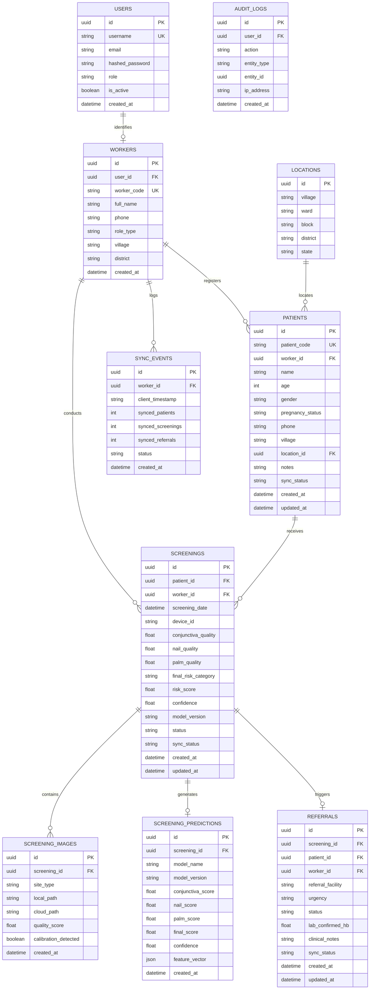

# Database Architecture & Entity Relationships

RaktDrishti uses **PostgreSQL** in production with **SQLAlchemy 2.0** ORM and **Alembic** migrations. For local offline execution on the Flutter client, it mirrors schemas using **SQLite** with synchronized UUID primary keys.

---

## 1. Entity-Relationship Diagram (ERD)

---

## 2. Synchronization & Conflict Resolution Strategy

1. **Client-Side UUID Primary Keys**: Ensures both offline SQLite client and PostgreSQL server use non-colliding entity identifiers.
2. **Sync Status Enum**:
   - `PENDING`: Stored locally on mobile device, waiting for internet connection.
   - `SYNCING`: Currently in transit in HTTP POST payload.
   - `SYNCED`: Successfully acknowledged by backend and committed to PostgreSQL.
   - `FAILED`: Encountered network/validation error, marked for exponential backoff retry.
3. **Deterministic Last-Write-Wins (LWW) with Audit Trail**:
   - Updates compare `updated_at` timestamps.
   - All inbound synchronizations write an entry to `audit_logs` and `sync_events`.
